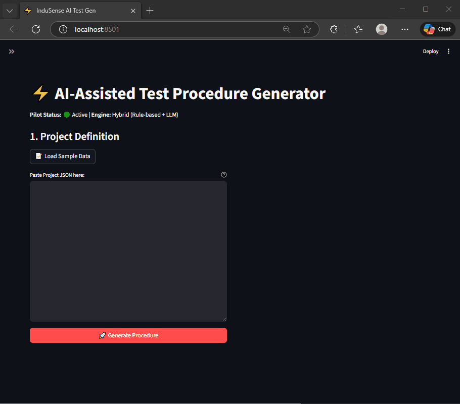

# ⚡ AI-Assisted Test Procedure Generator

[](https://www.python.org/downloads/)
[](https://opensource.org/licenses/MIT)

> **Automating the critical path from Engineering Requirements to FAT/SAT Procedures.**

---

### 🎥 Live Demo


_Generating a compliant Factory Acceptance Test in < 2 seconds._

---

## 📖 Overview

In industrial automation (HVAC, Manufacturing, Sensing), engineers spend up to **40% of their time** writing manual test documentation. This "End-to-End" pilot project demonstrates how a **Hybrid AI Engine** can reduce this time to seconds while maintaining strict engineering compliance.

**Key Capabilities:**

- **📄 PDF Generation:** Auto-creates signed, formatted Test Procedures.
- **🛡️ Validation Engine:** Deterministic rule-checks ensure 100% signal coverage.
- **🧠 Hybrid Intelligence:** Uses LLMs (OpenAI) for text generation but enforces Logic constraints for safety.

---

## 🏗️ Architecture

The system follows a modular **Hexagonal Architecture** to separate core logic from the AI providers.

- **Core:** Domain models (`Project`, `Signal`, `Requirement`).
- **AI Layer:** Pluggable providers (Mock for testing, OpenAI for Production).
- **Interface:** Streamlit Dashboard for rapid prototyping.

---

## 🚀 Quick Start

### 1. Installation

```bash
git clone [https://github.com/mirzazohaib/ai-test-procedure-generator.git](https://github.com/mirzazohaib/ai-test-procedure-generator.git)
cd ai-test-procedure-generator
python -m venv venv
# Windows
source venv/Scripts/activate
pip install -r requirements.txt
```

### 2. Configuration

Create a .env file for production mode (optional):

```bash
OPENAI_API_KEY=sk-...
```

### 3. Run the App

```bash
python -m streamlit run app/web/streamlit_app.py
```

---

## 📚 Documentation

Detailed documentation for developers and integrators:

- [📂 Project Architecture](docs/ARCHITECTURE.md) - Deep dive into Hexagonal layers and logic.

- [🚀 Deployment Guide](docs/DEPLOYMENT.md) - Docker and Cloud deployment strategies.

- [🔌 API Reference](docs/API.md) - Internal module interfaces and AI Provider contracts.

---

### ⚖️ Disclaimer

This is a personal portfolio project. It is a conceptual prototype designed to demonstrate software architecture and Generative AI capabilities in an engineering context. It is not affiliated with, endorsed by, or connected to any specific hardware manufacturer or company. All logos and system names used in examples are fictional or generic.

---

### 📜 License

Distributed under the MIT License. See [LICENSE](LICENSE) for more information.
