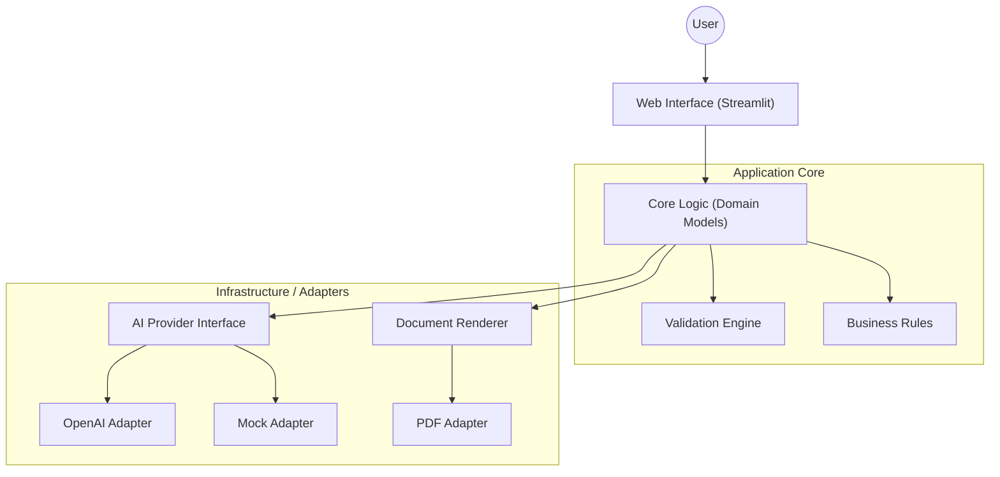

[⬅️ Back to README](../README.md)

---

# 🏗️ System Architecture

## Overview

InduSense Analytics follows the **Hexagonal Architecture** (Ports and Adapters) pattern. This ensures that the Core Business Logic (Test Generation Rules) is completely decoupled from external tools (OpenAI, Streamlit, PDF Engines).

## 🧩 High-Level Design

---

## 📂 Project Structure

| Directory | Layer           | Purpose                                                                                                       |
| --------- | --------------- | ------------------------------------------------------------------------------------------------------------- |
| app/core  | Domain          | Contains pure Python data models (Project, Signal) and business logic. No external dependencies allowed here. |
| app/ai    | Infrastructure  | Adapters for AI Providers. Uses the AIProvider interface to switch between Mock and OpenAI.                   |
| app/web   | Presentation    | The Streamlit UI. This is just a "dumb" view layer that calls the Core.                                       |
| app/rules | Domain Services | Deterministic validation logic (e.g., "Check if all signals have tests").                                     |

---

## 🧠 Key Design Decisions

- 1. The AIProvider Interface
     We use the Strategy Pattern for AI generation.
     Why? It allows us to run "Smoke Tests" in CI/CD pipelines using the MockProvider without spending money on API tokens.
     Benefit: Zero-cost testing and offline development capability.

- 2. Validation as a First-Class Citizen
     AI is non-deterministic. To make this an "Engineering Tool" rather than just a chatbot, we implemented a strict Validation Layer (app/rules).
     This layer parses the AI's output (Markdown) and compares it against the Input Schema.
     If the AI "hallucinates" a signal or forgets one, the Validation Layer flags it immediately.

- 3. Pydantic for Data Integrity
     All data flowing through the system is strictly typed using Pydantic V2. This prevents "Garbage In, Garbage Out" errors common in dynamic Python scripts.
